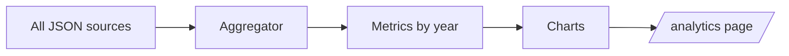

# Personal Analytics Dashboard (Planned)

Status: **planned hidden section**. Not rendered today.

## Purpose

A private dashboard showing growth over time, derived entirely from existing JSON:

- Projects shipped per year
- Publications per year
- Talks given
- Awards
- Certifications earned
- Open-source contributions

No external analytics service is required — the data is already in the repo.

## Feature Flag

In `site-config.json`:
```json
{
  "sections": [
    { "id": "analytics", "label": "Analytics", "visible": false }
  ]
}
```

When `visible: false` (default), no nav item, no route, no rendering.

## Future Implementation Sketch



Aggregation is a pure function over `projects.json`, `publications.json`, `talks.json`, `awards.json`, `certifications.json`, `open-source.json`. Run at build time; cache result.

## Metric Definitions

| Metric | Source | Bucket |
|---|---|---|
| Projects | `projects.json` | year derived from first commit / launch date |
| Publications | `publications.json` | `year` field |
| Talks | `talks.json` | `date` field, grouped by year |
| Awards | `awards.json` | `year` field |
| Certifications | `certifications.json` | `year` field |
| OSS contributions | `open-source.json` | optional `since` field |

## Privacy

Dashboard is fully derivable from public content. No tracking, no third-party scripts.
