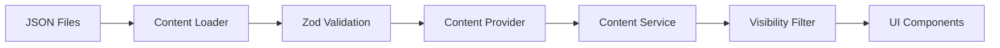

# Content Flow

1. JSON files in `src/data/` are imported.
2. Loader passes raw data through Zod schemas.
3. Provider returns typed data to the Content Service.
4. Service applies visibility and archive filters.
5. UI renders only the filtered, validated data.

Failure modes are caught at step 2 — invalid data never reaches the UI.
