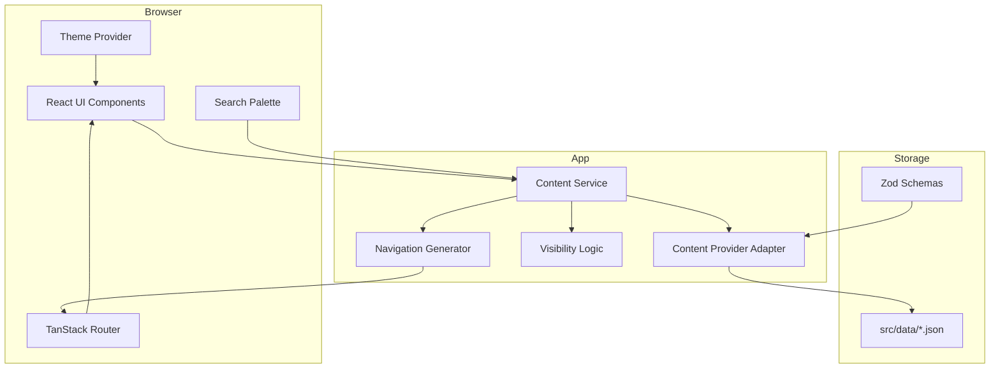

# Current Architecture

**Responsibilities**

- **UI Components**: stateless rendering, accessibility, animations.
- **TanStack Router**: file-based routing under `src/routes/`.
- **Content Service**: public domain API.
- **Content Provider**: pluggable adapter for the storage backend.
- **Visibility Logic**: filters `visible: false` and `archived: true`.
- **Navigation Generator**: derives nav from `site-config.json`.
- **Zod Schemas**: validate every JSON at load time.
