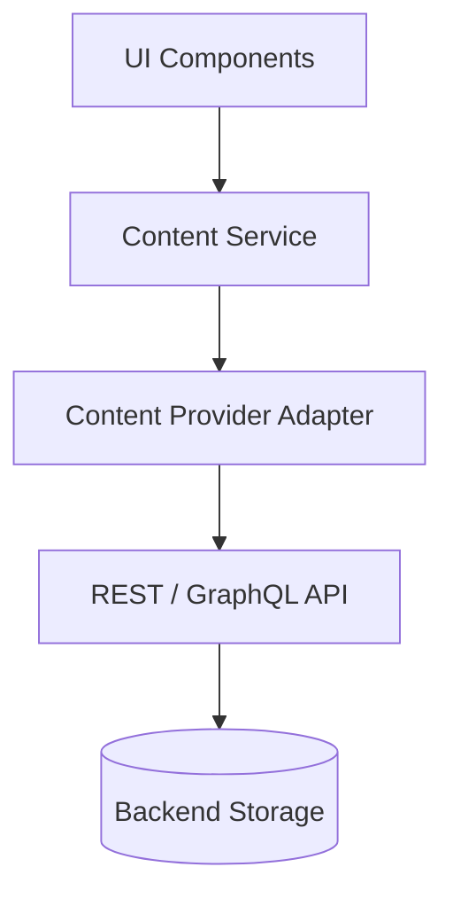

# Future API Migration

**Migration steps**

1. Stand up a REST or GraphQL API that returns the same shapes validated by Zod.
2. Implement `ApiContentProvider` that calls `fetch` and validates responses with existing schemas.
3. Add caching (TanStack Query) at the service layer.
4. UI unchanged.

Schemas in `public/schema/` double as API request/response contracts.
