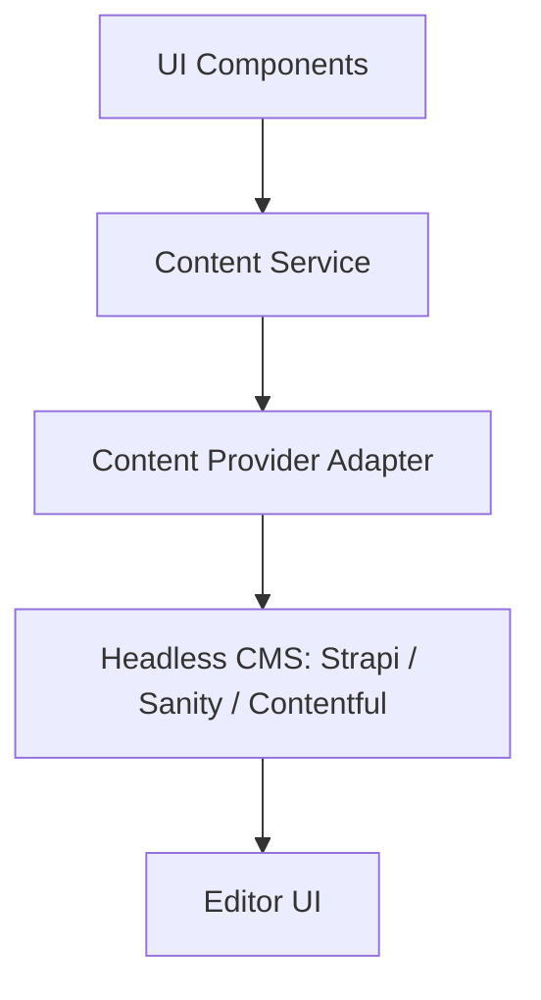

# Future CMS Migration

**Migration steps**

1. Pick a CMS that supports the existing Zod schemas (`public/schema/*.json`).
2. Import current JSON content into the CMS using its bulk import tool.
3. Implement a new `CmsContentProvider` matching the existing provider interface.
4. Switch the provider in the service layer via config.
5. UI components stay unchanged — they consume the same Content Service.

**What changes**: provider only.
**What doesn't change**: UI, routing, search, visibility logic, schemas, tests.
