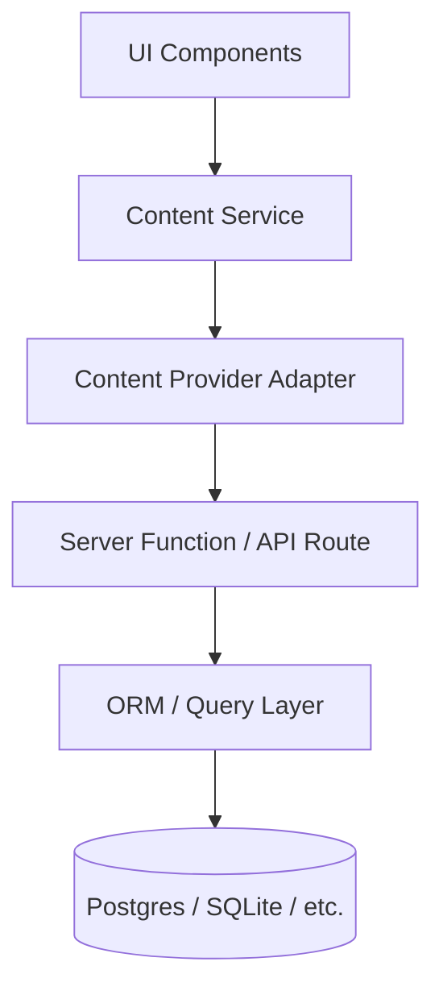

# Future Database Migration

**Migration steps**

1. Design tables matching JSON schemas; one table per top-level file is the simplest mapping.
2. Seed from existing JSON.
3. Add server functions that read from the database.
4. Implement `DbContentProvider`.
5. UI unchanged.

Visibility and archive flags become indexed columns; queries filter at the DB layer for performance.
