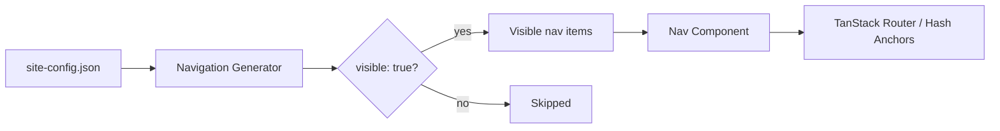

# Navigation Flow

```mermaid
flowchart LR
  Config[site-config.json] --> Gen[Navigation Generator]
  Gen --> Filter{visible: true?}
  Filter -- yes --> Items[Visible nav items]
  Filter -- no --> Skip[Skipped]
  Items --> Nav[Nav Component]
  Nav --> Router[TanStack Router / Hash Anchors]
```

- Only items with `visible: true` appear in the menu.
- Order is preserved from `site-config.json`.
- Section IDs are stable — see [URL Stability Policy](../url-policy.md).
