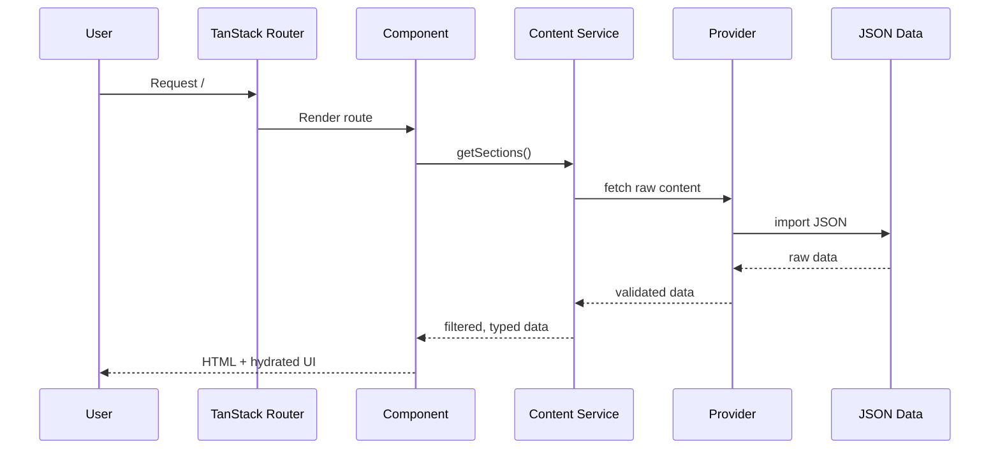

# Rendering Flow

```mermaid
sequenceDiagram
  participant U as User
  participant R as TanStack Router
  participant C as Component
  participant S as Content Service
  participant P as Provider
  participant D as JSON Data

  U->>R: Request /
  R->>C: Render route
  C->>S: getSections()
  S->>P: fetch raw content
  P->>D: import JSON
  D-->>P: raw data
  P-->>S: validated data
  S-->>C: filtered, typed data
  C-->>U: HTML + hydrated UI
```

SSR-friendly: all content is statically importable, so the same flow works at build time and runtime.
