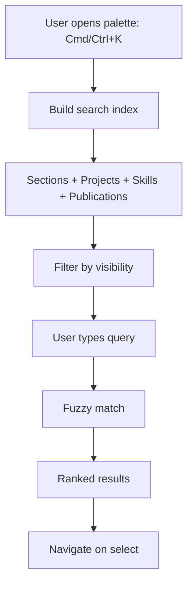

# Search Flow

```mermaid
flowchart TB
  Open[User opens palette: Cmd/Ctrl+K] --> Index[Build search index]
  Index --> Sources[Sections + Projects + Skills + Publications]
  Sources --> Filter[Filter by visibility]
  Filter --> Query[User types query]
  Query --> Match[Fuzzy match]
  Match --> Results[Ranked results]
  Results --> Nav[Navigate on select]
```

- Index is built from visible content only.
- Hidden / archived entries are excluded.
- Selecting a result triggers router navigation or scroll-to-section.
