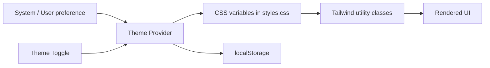

# Theme Flow

```mermaid
flowchart LR
  Pref[System / User preference] --> Provider[Theme Provider]
  Provider --> Tokens[CSS variables in styles.css]
  Tokens --> Components[Tailwind utility classes]
  Components --> UI[Rendered UI]
  Toggle[Theme Toggle] --> Provider
  Provider --> Storage[localStorage]
```

- Tokens are semantic (`--background`, `--foreground`, `--primary`).
- Components never use raw color classes.
- Persisted choice survives reloads.
