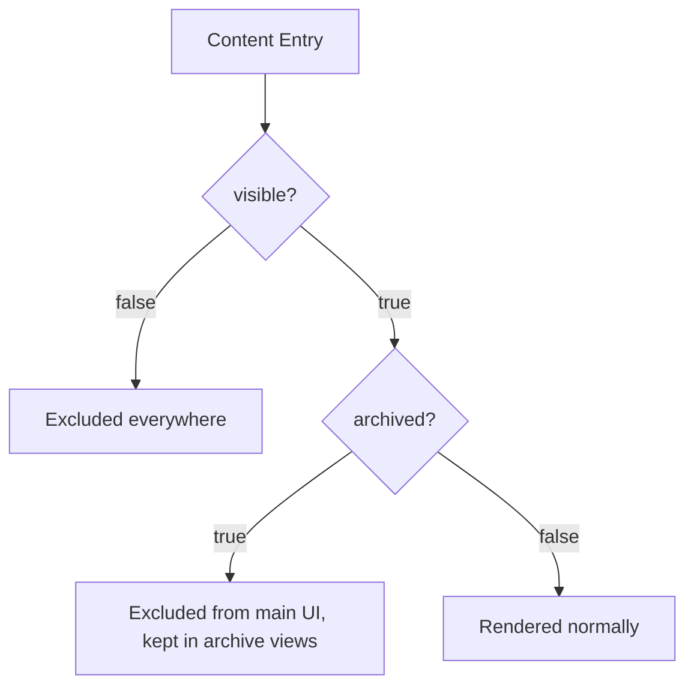

# Visibility Flow

**Rules**

- `visible: false` → not rendered, not searchable, not in nav.
- `visible: true, archived: true` → hidden from default views but retained for historical reference and optional archive pages.
- `visible: true, archived: false` (or omitted) → fully rendered.

See [Archive Strategy](../archive-strategy.md).
