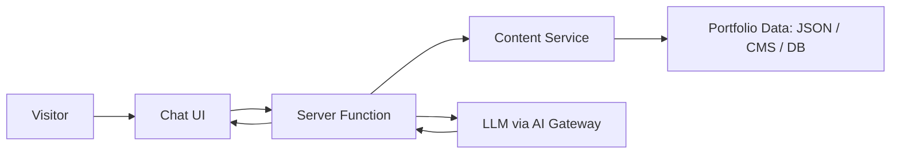

# Future AI Integration

Status: **planned**. No implementation today.

## Vision

Allow visitors to chat with an AI assistant grounded in the portfolio's own data:

> "What did you build at Acme?"
> "Show me your TypeScript projects."
> "Summarize your publications on graph theory."

## Architecture



The AI assistant reads from the **same Content Service** the UI uses. No new data store, no separate vector DB initially — embeddings are computed at build time from the existing JSON.

## Integration Points

1. **Retrieval**: a `getKnowledgeBase()` function in the Content Service returns visibility-filtered, archived-excluded entries as a flat list with metadata.
2. **Embedding** (optional): pre-compute embeddings per entry at build time; ship as a static JSON.
3. **LLM call**: a server function (`createServerFn`) accepts a query, retrieves top-K entries, and prompts the LLM via Lovable AI Gateway.
4. **UI**: a floating chat widget at the corner of the page, opt-in via `site-config.json` feature flag.

## Why This Doesn't Require a Redesign

- Content Service is already the single source of truth.
- Visibility logic already filters what the public can see — apply the same filter to the AI's knowledge base.
- The chat widget is additive UI; existing components untouched.

## Safety Notes

- Cap response length; rate-limit per IP.
- Never let the LLM expose `visible: false` content.
- Log queries (without PII) for quality review.
- Provide a disclaimer that responses are AI-generated.

## Feature Flag

```json
{ "features": { "aiAssistant": false } }
```

Ship disabled. Enable per environment when ready.
